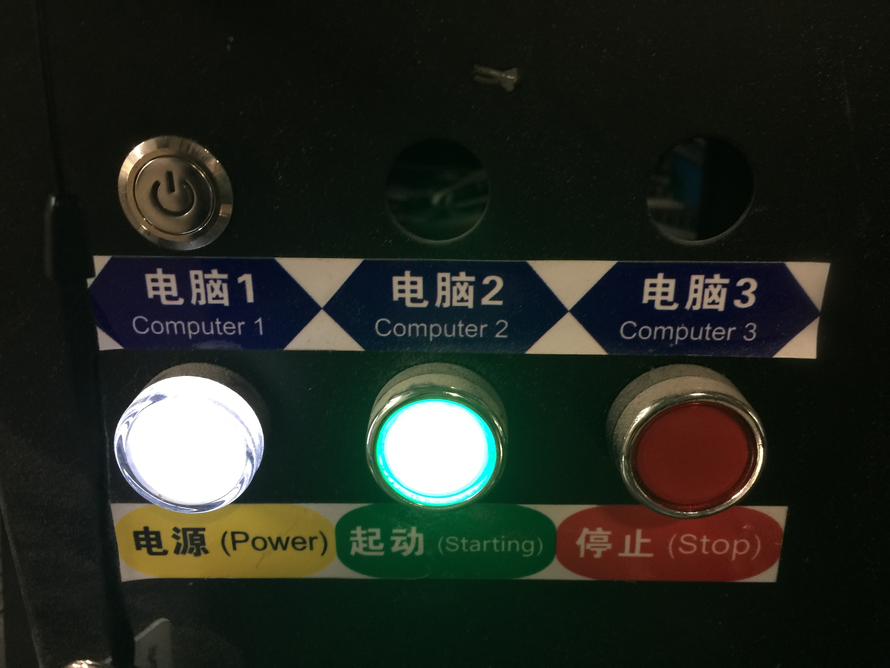
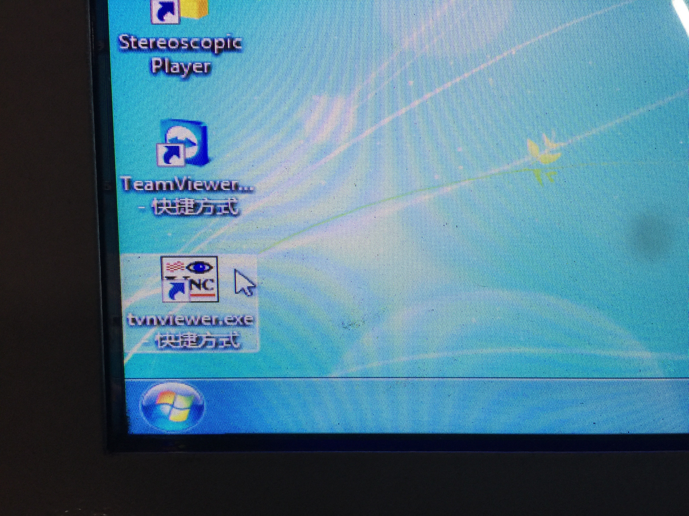
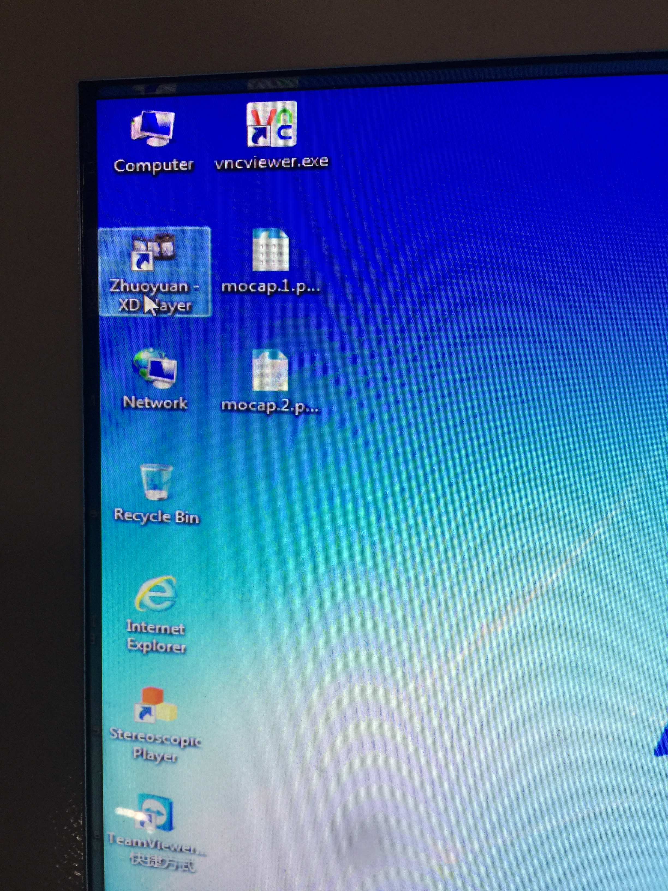

# Virtual Flight Platform

This program is designed to control the VR platfrom and perform basic moving commands for a single axis or comlicated motions (multiaxes) to imitate flying

#Hardware Required:
[9DVR platfrom](http://www.xd5d.com/9dvr/)

#Software Required:
.NetFramework

#Steps
##Start Procedure
1. Plug on the power cord
2. Push the green button
3. Push the power button for computer 1(It's above the green button)

4. Push the power button on the master computer(on the right side of the computer)
5. Wait for both two computers to start
6. Double-Click the VNC software

7. Set IP to 192.168.1.2 

8. Connect
9. Open the program on the slave computer
10. Click the "Open the device" button
11. Click the "Flight Mode" button
12. Go back to the desktop of the master computer
13. Open the Zhuoyuan Movie program

14. If you see hear the "ka-da", then the motor controllers are turned on
15. Go back to the program on the slave computer
16. Using keyboard or mouse to control the platform

##Exit Procedure
1. Close the flight mode window
2. Click the disconnect button
3. Close the program
4. Go back to the master computer
5. Close the Zhuoyuan Movie program (Click the power off button then the exit button)

#FAQ
### What should I do if the direction get reversed?
* A: Close both two programs and computers. Push the red button(STOP) on the platform. Wait for at least 10s, then execute the turn on procedure.

### How can I home the platform?
* A: First, make sure the actual moving direction corresponds to the encoder data on the program. If not, see FAQ1 first. 
*    Then, click the Home button on the main menu. 
*    After that, select the axis that is not homed, and choose the Searching Home Direction (should be negative). You can also adjust home speed there
*    Click "Home" button and wait for the axis to go back to home position.
*    When the axis reaches zero, click the Stop Homing button.
*    Click the set pos button to set its current position to zero
*    select another axis and complete the steps above

Note: You do not need to home the 4th axis(the rotary axis)

